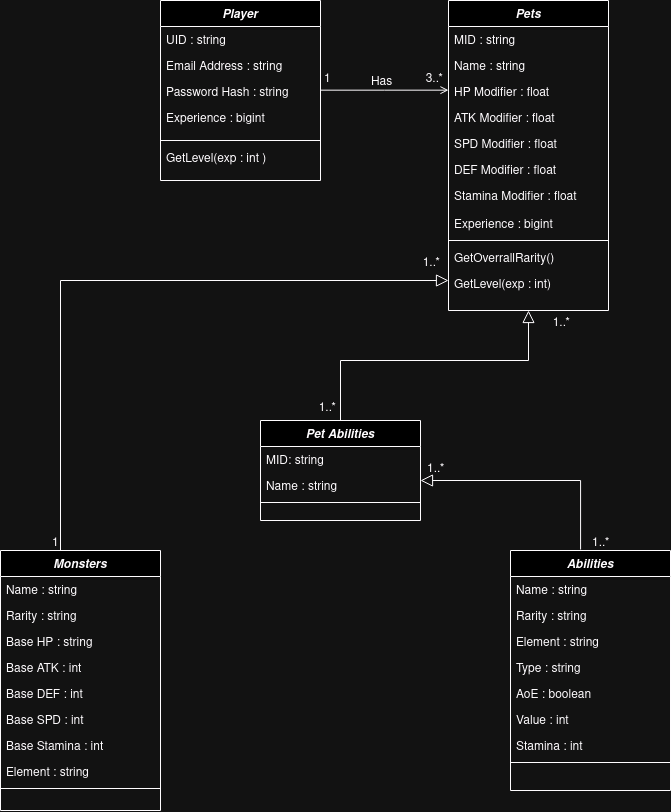

# ROTCL - Realm of the Counter Legends

* 2-D multiplayer monster battle game built using *ReactJs*, *TailwindCSS* and *Sockets.io*.

* Backend - *NodeJs*, *Express* and *Azure SQL*.

#### Backend Source Code  - https://github.com/vishal-menon/ROTCL-Backend.git

## DB Architecture

